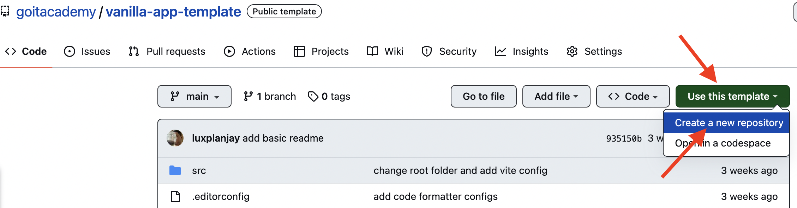

Vanilla App Template

Этот проект был создан при помощи Vite. Для знакомства и настройки
дополнительных возможностей [обратись к документации](https://vitejs.dev/).

## Создание репозитория по шаблону

Используй этот репозиторий организации GoIT как шаблон для создания репозитория
своего проекта. Для этого нажми на кнопку `«Use this template»` и выбери опцию
`«Create a new repository»`, как показано на изображении.



На следующем шаге откроется страница создания нового репозитория. Заполни поле
его имени, убедись, что репозиторий публичный, после чего нажми кнопку
`«Create repository from template»`.


После того как репозиторий будет создан, необходимо перейти в настройки
созданного репозитория на вкладку `Settings` > `Actions` > `General` как
показано на изображении.


Проскролив страницу до самого конца, в секции `«Workflow permissions»` выбери
опцию `«Read and write permissions»` и поставь галочку в чекбоксе. Это
необходимо для автоматизации процесса деплоя проекта.


Теперь у тебя есть личный репозиторий проекта, со структурой файлов и папок
репозитория-шаблона. Далее работай с ним, как с любым другим личным
репозиторием, клонируй его себе на компьютер, пиши код, делай коммиты и
отправляй их на GitHub.

## Подготовка к работе

1. Убедись что на компьютере установлена LTS-версия Node.js.
   [Скачай и установи](https://nodejs.org/en/) её если необходимо.
2. Установи базовые зависимости проекта в терминале командой `npm install`.
3. Запусти режим разработки, выполнив в терминале команду `npm run dev`.
4. Перейди в браузере по адресу [http://localhost:5173](http://localhost:5173).
   Эта страница будет автоматически перезагружаться после сохранения изменений в
   файлах проекта.

## Файлы и папки

- Файлы разметки компонентов страницы должни находиться в папке `src/partials` и
  импортироваться в файл `index.html`. Например, файл с разметкой хедера
  `header.html` создаем в папке `partials` и импортируем в `index.html`.
- Файлы стилей должны лежать в папке `src/css` и импортироваться в HTML-файлы
  страниц. Например, для `index.html` файл стилей называется `index.css`.
- Изображения добавляй в папку `src/img`. Сборщик оптимизирует их, но только при
  деплое продакшн версии проекта. Все это происходит в облаке, чтобы не
  нагружать твой компьютер, так как на слабых машинах это может занять много
  времени.

## Деплой

Продакшн версия проекта будет автоматически собираться и деплоиться на GitHub
Pages, в ветку `gh-pages`, каждый раз когда обновляется ветка `main`. Например,
после прямого пуша или принятого пул-реквеста. Для этого необходимо в файле
`package.json` изменить значение флага `--base=/<REPO>/`, для команды `build`,
заменив `<REPO>` на название своего репозитория, и отправить изменения на
GitHub.

```json
"build": "vite build --base=/<REPO>/",
```

Далее необходимо зайти в настройки GitHub-репозитория (`Settings` > `Pages`) и
выставить раздачу продакшн версии файлов из папки `/root` ветки `gh-pages`, если
это небыло сделано автоматически.


### Статус деплоя

Статус деплоя крайнего коммита отображается иконкой возле его идентификатора.

- **Желтый цвет** - выполняется сборка и деплой проекта.
- **Зеленый цвет** - деплой завершился успешно.
- **Красный цвет** - во время линтинга, сборки или деплоя произошла ошибка.

Более детальную информацию о статусе можно посмотреть кликнув по иконке, и в
выпадающем окне перейти по ссылке `Details`.


### Живая страница

Через какое-то время, обычно пару минут, живую страницу можно будет посмотреть
по адресу указанному на вкладке `Settings` > `Pages` в настройках репозитория.
Например, вот ссылка на живую версию для этого репозитория
[https://goitacademy.github.io/vanilla-app-template/](https://goitacademy.github.io/vanilla-app-template/).

Если открывается пустая страница, убедись что во вкладке `Console` нет ошибок
связанных с неправильными путями к CSS и JS файлам проекта (**404**). Скорее
всего у тебя неправильное значение флага `--base` для команды `build` в файле
`package.json`.

## Как это работает


1. После каждого пуша в ветку `main` GitHub-репозитория, запускается специальный
   скрипт (GitHub Action) из файла `.github/workflows/deploy.yml`.
2. Все файлы репозитория копируются на сервер, где проект инициализируется и
   проходит линтинг и сборку перед деплоем.
3. Если все шаги прошли успешно, собранная продакшн версия файлов проекта
отправляется в ветку `gh-pages`. В противном случае, в логе выполнения скрипта
будет указано в чем проблема.
<!-- IIIIIIIIIIIIIIIIIIIIIIIIIIIIIIIIIIIIIIIIIIIIIIIII -->

# Image Search

This is a simple image search application that uses the Pixabay API to fetch
images based on a user's query. The application includes features such as image
loading, error handling, and a loading indicator.

## Installation

1. Clone the repository.
2. Run `npm install` to install dependencies.
3. Run `npm run dev` to start the development server.

## Usage

1. Open the application in your browser.
2. Enter a search query in the input field.
3. Click the "Search" button to fetch images.
4. The application will display the images in a gallery format.
5. Click on an image to view it in a lightbox.

## Contributing

Contributions are welcome. Please create a pull request with your changes.

## License

This project is licensed under the MIT License.

<!-- UUUUUUUUUUUUUUUUUUUUUU -->

# Create a new GitHub Pages site

npx create-github-pages

# Initialize the site

npm init

# Install dependencies

npm install

# Start the development server

npm run dev

# Build and deploy the site

npm run build

<!-- RRRRRRRRRRRRRRRRRRRRRRRRRRR -->

# Install Vite

npm install vite

# Create a new Vite project

npx vite new

# Initialize the project

npm init

# Install dependencies

npm install

# Start the development server

npm run dev

# Build and deploy the site

npm run build

<!-- ++++++++++++++++++++++++++ -->
<!DOCTYPE html>
<html>
<head>
  <title>Image Gallery</title>
  <style>
    /* Стили из предоставленного кода CSS */
    /* ... */

    /* Стили для навигационных стрелок */
    .gallery-nav {
      position: absolute;
      top: 50%;
      transform: translateY(-50%);
      z-index: 9999999;
      display: none;
      font-size: 48px;
      color: #ff00b3;
      padding: 10px;
      background-color: rgba(255, 255, 255, 0.5);
      border-radius: 50%;
      cursor: pointer;
    }

    .gallery-nav.prev {
      left: 10px;
    }

    .gallery-nav.next {
      right: 10px;
    }

  </style>
</head>
<body>
  <!-- Форма и галерея из предоставленного кода HTML -->
  <!-- ... -->

  <div id="modal" class="modal">
    <span class="close-button">&times;</span>
    
    <div id="caption"></div>
  </div>

  <div class="gallery-nav prev" id="prev-btn">&#10094;</div>
  <div class="gallery-nav next" id="next-btn">&#10095;</div>

  <script>
    // Код JavaScript из предоставленного кода
    // ...

    // Получаем необходимые элементы
    const modal = document.getElementById('modal');
    const modalImage = document.getElementById('modal-image');
    const caption = document.getElementById('caption');
    const prevBtn = document.getElementById('prev-btn');
    const nextBtn = document.getElementById('next-btn');

    // Массив с изображениями
    let images = [];

    // Функция для открытия модального окна с изображением
    function openModal(index) {
      modal.style.display = 'block';
      modalImage.src = images[index].src;
      caption.textContent = images[index].alt;

      // Показываем навигационные стрелки
      prevBtn.style.display = 'block';
      nextBtn.style.display = 'block';

      // Устанавливаем обработчики событий для навигационных стрелок
      prevBtn.addEventListener('click', () => showPreviousImage(index));
      nextBtn.addEventListener('click', () => showNextImage(index));
    }

    // Функция для закрытия модального окна
    function closeModal() {
      modal.style.display = 'none';

      // Скрываем навигационные стрелки
      prevBtn.style.display = 'none';
      nextBtn.style.display = 'none';

      // Удаляем обработчики событий для навигационных стрелок
      prevBtn.removeEventListener('click', showPreviousImage);
      nextBtn.removeEventListener('click', showNextImage);
    }

    // Функция для показа предыдущего изображения
    function showPreviousImage(index) {
      const newIndex = (index - 1 + images.length) % images.length;
      openModal(newIndex);
    }

    // Функция для показа следующего изображения
    function showNextImage(index) {
      const newIndex = (index + 1) % images.length;
      openModal(newIndex);
    }

    // Обработчик события клика на изображение в галерее
    document.querySelectorAll('.card img').forEach((img, index) => {
      img.addEventListener('click', () => {
        images = Array.from(document.querySelectorAll('.card img'));
        openModal(index);
      });
    });

    // Обработчик события клика на крестик для закрытия модального окна
    document.querySelector('.close-button').addEventListener('click', closeModal);

    // Обработчик события клика вне модального окна для закрытия
    window.addEventListener('click', (event) => {
      if (event.target == modal) {
        closeModal();
      }
    });
  </script>
</body>
</html>
